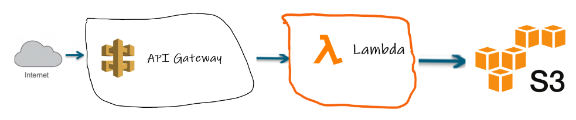

# Web App
* [View the Office temperature](https://clintpitzak.com/app/weather/index.html)

# AWS Architecture
Using S3 instead of a database because it's cheaper and I'm paying the bill :wink:

* [Steps to setup the AWS Architecture](aws-setup/README.md)

# Hardware

# Code
* [The code that reads the sensor](https://github.com/cpitzak/dht22Service4ApiEndpoints)
* [The code that displays the website](https://github.com/cpitzak/clintpitzak.com/tree/master/app/weather)